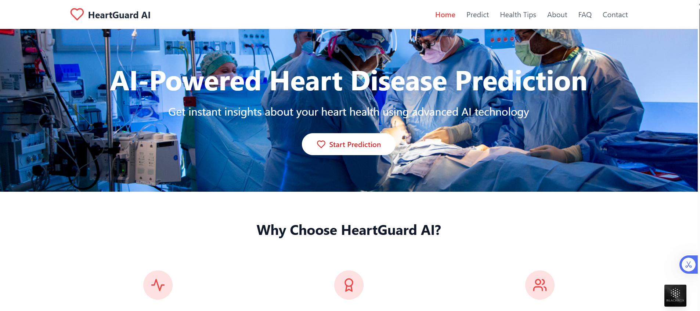
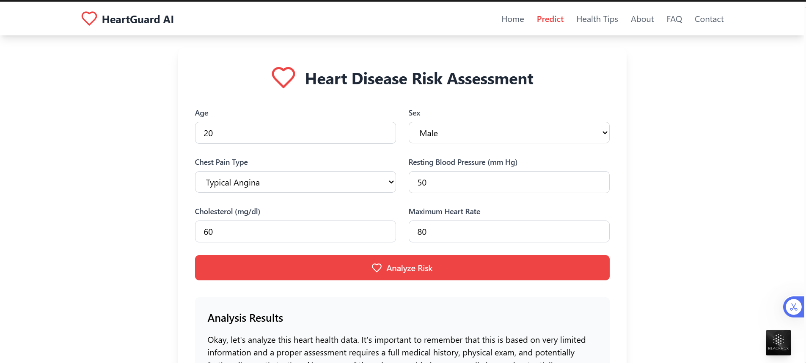

# Heart Disease Prediction App

## Description

This application uses advanced AI technology to predict heart disease and provide health tips. Users can log in, sign up, and access personalized health information.

## Installation

1. Clone the repository:

   ```bash
   git clone https://github.com/Arihant09x/HeartGuard-AI.git
   cd src
   ```

2. Install dependencies:

   ```bash
   npm install
   ```

3. Set up environment variables:
   - Create a `.env` file in the root directory and add your Supabase URL and Anon Key:
     ```
     VITE_SUPABASE_URL=<your-supabase-url>
     VITE_SUPABASE_ANON_KEY=<your-supabase-anon-key>
     VITE_GEMINI_API_KEY=<your_gemini_api_key>
     ```

## Usage

1. Start the development server:

   ```bash
   npm run dev
   ```

2. Open your browser and navigate to `http://localhost:3000`.

3. Use the login or signup page to access the application.

## Features

- User authentication (login and signup)
- Heart disease prediction
- Health tips and resources
- User-specific content

## Screenshots





## License

This project is licensed under the MIT License.
